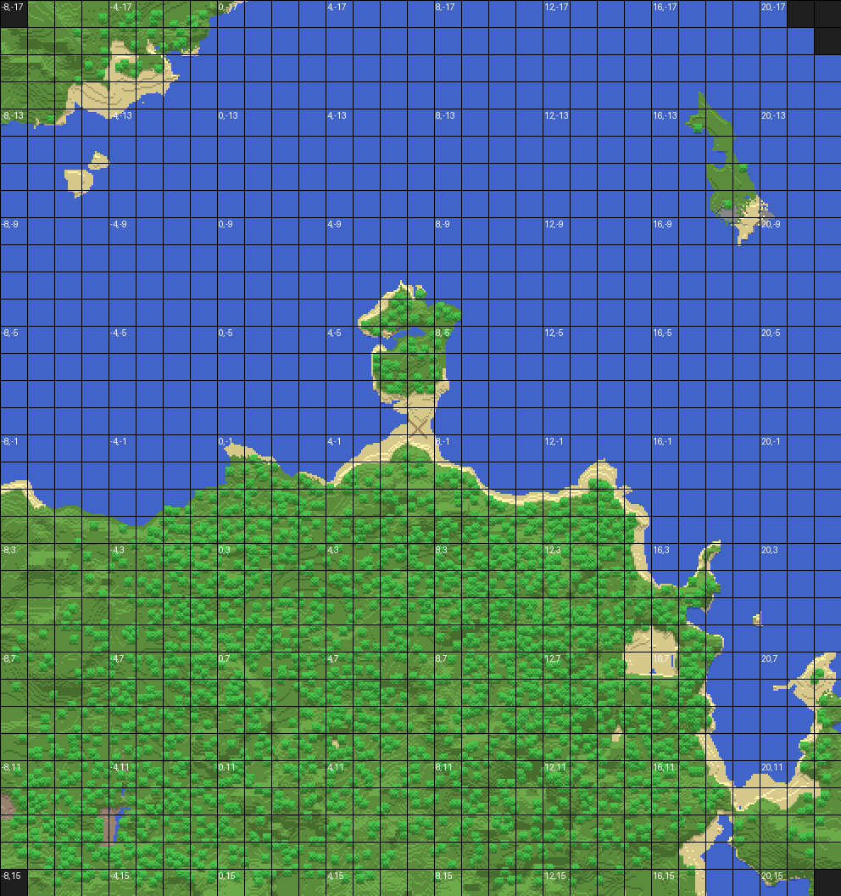

# Infdev / Alpha World Map Viewer

A command-line tool for visualising and exploring Minecraft worlds that use the **Alpha level format** (Alpha Level Format is the way minecraft saved the worlds in these versions, I have shortened it to ALF, and will often use ALF and Alpha Level Format interchangeably. Just because it has Alpha in its name doesnt mean it is only for Alpha versions, it is in the versions described in here) — individual gzipped NBT chunk files stored in base36-named subdirectories. This format was used from **Infdev 20100327** through **Beta 1.2_02**, before Mojang switched to the McRegion format in Beta 1.3.

<table>
  <tr>
    <td></td>
    <td></td>
  </tr>
  <tr>
    <td align="center">Shaded (grid)</td>
    <td align="center">Shaded (clean)</td>
  </tr>
</table>

(Screenshots taken in Infdef 20100611)
---

## Features

- Renders a top-down map of every loaded chunk in your world
- Two map styles: **flat** (colour-coded by block type) and **shaded** (elevation shading, similar to Minecraft's in-game maps)
- Each style is saved in two versions: one with a chunk coordinate grid, one without
- Search for any block by ID across all loaded chunks and print every coordinate
- Export large search results to a `.txt` file
- Prints world info on startup: seed, player position, and days played

---

## Planned Features

- Removing the need for a python installation, making it all a portable .exe file.
- Removing cmd line use making it all a graphical window.
- Chunk trimming in worlds.
- Copy/paste chunks around your world, or into other worlds.
- Move any chunk anywhere in the world.
- The ability to save certain chunks into a file(s) that can be imported to any world, anywhere.
- Potentially a feature to view each layer of blocks in a minecraft world, and render an image of it.
- Possibly more in the future!

---

## Requirements

- **Python 3.10 or later** — [Download here](https://www.python.org/downloads/)  
  *(Python 3.14 was used during development)*
- The following libraries are **installed automatically** on first run:
  - `nbtlib`
  - `Pillow`

---

## Installation

1. Download `MC-ALF-Viewer.py` from this repository
2. Place it somewhere easy to find, for example `D:\Tools\MC-ALF-Viewer.py`
3. That's it. Only python installation is required.
4. Currently only windows is being tested and supported, but macOS and Linux are plaanned for in the future. This does not mean you cant get any aspect of the program to work, it is just unsupported so it might not work as intended or at all.

---

## Opening a Terminal

**Windows:**  
Press `Win`, type `cmd`, and hit Enter. A Command Prompt window will open.

**macOS:**  
Press `Cmd + Space`, type `Terminal`, and hit Enter.

**Linux:**  
Press `Ctrl + Alt + T`, or search for Terminal in your applications menu.

---

## Running the Tool

In your terminal, type the command in this format:

```
python "C:\path\to\MC-ALF-Viewer.py" "C:\path\to\your\world"
```

The world path should point to the folder that contains `level.dat` — not the saves folder itself. It is usually called World1 in these versions, but can be different.

**Example:**
```
python "D:\Games\Minecraft (PrismLauncher)\MC-ALF-Viewer.py" "D:\Games\Minecraft (PrismLauncher)\instances\infdev 20100611\minecraft\saves\World1"
```

> **Note:** If any part of your path contains spaces, wrap the whole path in double quotes `"` as shown above.

---

## Usage

Once running, the tool will display basic world information:

```
=== World Info ===
  Seed        : -1123209206135229985
  Player pos  : X=-23.2  Y=97.9  Z=-31.3
  World time  : 482562 ticks  (~day 20)
```

You will then see the main menu:

```
========================================
  What would you like to do?
  1 = Render map image(s)
  2 = Search for blocks
  3 = Quit
========================================
```

### Option 1 — Render Map

You will be asked which style to generate:

```
  1 = Flat only
  2 = Shaded map only
  3 = Both
```

Then enter a save path including the filename and extension:

```
Save map image to (e.g. D:\Pictures\infdev_map.png): D:\OneDrive\Pictures\Minecraft Screenshots\Map.png
```

Depending on your choice, up to four files will be saved, named automatically:

| File | Description |
|------|-------------|
| `Map_flat.png` | Flat colour map with chunk grid |
| `Map_flat_clean.png` | Flat colour map without grid |
| `Map_shaded.png` | Elevation-shaded map with chunk grid |
| `Map_shaded_clean.png` | Elevation-shaded map without grid |

**Supported image formats:** PNG, JPG/JPEG, BMP, GIF, WebP

### Option 2 — Search for Blocks

Enter a numeric block ID to find every instance of that block across all loaded chunks. The tool will print the first 30 results with X, Y, Z coordinates. If more than 30 are found, you will be offered the option to export all coordinates to a `.txt` file.

**Common block IDs:**

| ID | Block | ID | Block |
|----|-------|----|-------|
| 1  | Stone | 49 | Obsidian |
| 2  | Grass | 52 | Mob Spawner |
| 7  | Bedrock | 54 | Chest |
| 12 | Sand | 56 | Diamond Ore |
| 14 | Gold Ore | 73 | Redstone Ore |
| 15 | Iron Ore | 21 | Lapis Lazuli Ore |
| 16 | Coal Ore | 89 | Glowstone |

### Option 3 — Quit

Exits the program.

---

## Finding Coordinates In-Game

Most Infdev and early Alpha versions do not display coordinates on screen by default. A few options:

- **Use a mod** — [coordinates-(old-mc) on Modrinth](https://modrinth.com/mod/coordinates-(old-mc)) has coordinate display mods for several of these versions
- **Use NBTExplorer** — you can manually edit your player's `Pos` tag in `level.dat` to teleport to a set of coordinates

---

## Optional Command-Line Arguments

These can be appended to your command to skip prompts or change behaviour:

| Argument | Description |
|----------|-------------|
| `--scale 1` | 1 pixel per block (smaller image, faster, good for large worlds) |
| `--scale 4` | 4 pixels per block (larger image, no new detail) |
| `--info` | Print world info only and exit, no map or search |

As of now these are mostly useless, leaving nothing is perfectly fine.

**Example with scale:**
```
python "D:\Tools\infdev_map.py" "D:\worlds\World1" --scale 4
```

---

## Notes

- The tool works with any world size — it dynamically calculates the map dimensions from whatever chunks are present
- Very large worlds may produce very large image files. Use `--scale 1` (or type nothing and it will default to scale 1) to reduce output size if needed
- Unknown block IDs are rendered in **bright magenta** on the map so they are easy to spot
- This tool is read-only — it does not modify your world in any way as of yet.
- This project is very early on, being worked on by a solo dev with little experience. Please do let me know of any issues you come across, and suggest any features you think should be added.

---

## Compatibility

(Only Infdev 20100611 has been tested fully, but there should be 0 issues with compatible versions)

| Format | Supported |
|--------|-----------|
| Infdev 20100327 – Beta 1.2_02 (Alpha level format) | ✅ Yes |
| Beta 1.3+ (McRegion `.mcr` format) | ❌ No |
| Release 1.2+ (Anvil `.mca` format) | ❌ No |
| Pre Infdev 20100327 (Alpha level format) | ❌ No |
